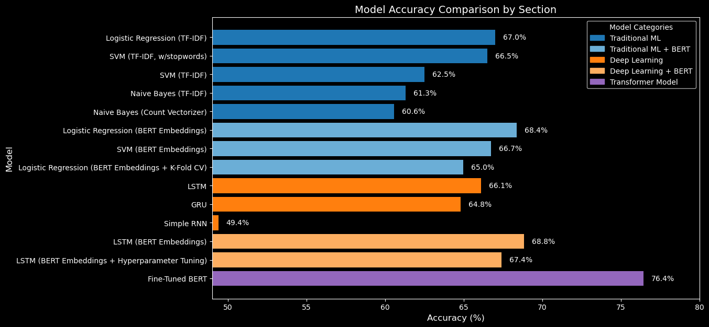

# Financial Sentiment Analysis with Machine Learning & Deep Learning

## Overview
This project explores **Financial Sentiment Analysis** using various **Machine Learning (ML), Deep Learning (DL), and Transformer-based models** to classify financial sentences into **positive, neutral, or negative** sentiments. It includes a comparative study of different models, analyzing their performance, advantages, and limitations.

## Dataset: Financial PhraseBank
The dataset used in this project is the **Financial PhraseBank**, sourced from Kaggle:  
[Financial Sentiment Analysis Dataset on Kaggle](https://www.kaggle.com/datasets/sbhatti/financial-sentiment-analysis)

This dataset originates from the **paper**:  
**"Good Debt or Bad Debt: Detecting Semantic Orientations in Economic Texts"**  
by **Malo, Pekka, et al.**, *Journal of the Association for Information Science and Technology*, 65(4), 782-796 (2014).

### **Dataset Details**
- **Source**: Financial news articles & company press releases  
- **Size**: 5000 labeled sentences  
- **Classes**: 
  - **Positive**
  - **Negative**
  - **Neutral**
- **Annotation**: Labeled by 16 business experts  
- **Challenges**:
  - **Imbalanced data** (neutral class dominates)
  - **Small dataset size** (only 5000 sentences)
  - **Domain-specific vocabulary** requiring specialized NLP techniques  

---

## Models & Techniques Explored

This project evaluates multiple **ML, DL, and Transformer-based models** for financial sentiment classification. The models are grouped as follows:

### **1. Traditional Machine Learning Models**
- **Naive Bayes** (Count Vectorizer, TF-IDF)
- **Support Vector Machine (SVM)** (Count Vectorizer, TF-IDF)
- **Logistic Regression** (Count Vectorizer, TF-IDF)
- **Logistic Regression + BERT Embeddings**
- **Logistic Regression + BERT Embeddings + K-Fold Cross-Validation**

### **2. Deep Learning Models**
- **Simple RNN**
- **GRU**
- **LSTM**
- **LSTM + BERT Embeddings**
- **LSTM + BERT Embeddings + Hyperparameter Tuning**

### **3. Transformer Model**
- **Fine-Tuned BERT (Pretrained Transformer model)**  

---

## **Key Findings**
- **Best performing model**: **Fine-Tuned BERT** (76.44% accuracy)  
- **Logistic Regression with BERT embeddings** (68.39%) outperformed traditional ML models with TF-IDF.  
- **Deep Learning models (LSTM, GRU, RNN)** showed moderate accuracy but required careful hyperparameter tuning.  
- **Fine-tuning BERT significantly improved sentiment classification**, benefiting from contextual embeddings and transfer learning.  
- **Computational cost**: Fine-tuning BERT is highly resource-intensive compared to traditional ML models.

---

## **Model Performance Summary**
Below is a **visual comparison of all models** tested in this project.

  

This chart illustrates the accuracy of each model, grouped by category.

---

## **Technologies Used**
- **Python**
- **Scikit-learn** (Machine Learning models)
- **TensorFlow & Keras** (Deep Learning models)
- **Hugging Face Transformers** (Fine-tuning BERT)
- **Matplotlib & Seaborn** (Visualization)
- **KerasTuner** (Hyperparameter Tuning)

---

## **Future Considerations**
- **Using larger datasets** to improve generalization.
- **Exploring more transformer models** (e.g., RoBERTa, FinBERT).
- **Implementing sentiment-aware attention mechanisms** in deep learning models.
- **Leveraging cloud-based GPUs** for more efficient fine-tuning.
